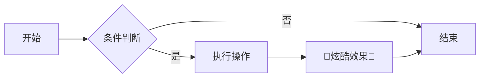

# ✨ 𝔽𝕒𝕟𝕔𝕪 𝕄𝕒𝕣𝕜𝕕𝕠𝕨𝕟 𝕊𝕙𝕠𝕨𝕔𝕒𝕤𝕖 ✨

## 🎨 彩色文字 & 样式
- <span style="color: #FF6B6B; font-weight: bold;">炽热红色</span>
- <span style="background: linear-gradient(90deg, #FF9A8B, #FF6A88); -webkit-background-clip: text; -webkit-text-fill-color: transparent; font-size: 1.2em;">**渐变炫彩文字**</span>
- <span style="font-family: 'Comic Sans MS', cursive; text-shadow: 2px 2px 4px rgba(0,0,0,0.3);">卡通字体 + 阴影</span>

## 📊 高级表格（对齐 + 表情符）

| 功能         | 效果演示          | 支持平台       | 喜爱度 |
|--------------|-------------------|----------------|--------|
| ✅ 合并单元格 | 合并示例 →        | GitHub, Typora | ⭐⭐⭐⭐  |
| 🔄 动态颜色   | <span style="color:green">绿色成功</span> | VS Code        | ⭐⭐⭐⭐⭐ |
| 🎲 行高亮     | **我是重点行！**  | Obsidian       | ⭐⭐⭐⭐  |

## � 折叠块 + 隐藏内容

<details>
<summary>📦 <strong>点击展开神秘代码！</strong></summary>

```python
# 超级加密算法 (伪代码)
def quantum_encrypt(data):
    return "".join([chr(ord(c) ^ 0xDEADBEEF) for c in data])

print(quantum_encrypt("Hello Fancy MD!"))
```
</details>

## 🎯 流程图 & 图表 (Mermaid)



## 📌 高亮便签效果

> [!NOTE]  
> **这是重要提示！**  
> Markdown 也可以有类似便签的区块样式

> [!WARNING]  
> <span style="color: orange">**警告！花哨过度可能导致眼花**</span>

## 🧮 数学公式（LaTeX）

行内公式： $E = mc^2$

块级公式：

$$
\oint\limits_{C} \vec{B} \cdot \mathrm{d}\vec{\ell} \, = \, \mu_{0} \left( I + \epsilon_{0} \frac{\mathrm{d}}{\mathrm{d}t} \iint\limits_{S} \vec{E} \cdot \mathrm{d}\vec{A} \right)
$$


## 🔀 分割线艺术

* * *

✂️ - - - - - ✂️ - - - - - ✂️

* * *

## 🎁 终极花哨大礼包

<div style="
    border: 2px dashed #FF9E44;
    border-radius: 15px;
    padding: 20px;
    background: #FFF5E6;
    box-shadow: 0 8px 16px rgba(255,158,68,0.3);
    transform: rotate(1deg);
">
    <h3 style="text-align: center; margin-top: 0;">🎉 <strong>恭喜！</strong> 🎉</h3>
    <p>你发现了<mark style="background: #FFD166; padding: 2px 8px;">花哨 Markdown 的终极秘密</mark></p>
    <div style="display: flex; justify-content: center; margin: 15px 0;">
        <div style="width: 50px; height: 50px; background: #EF476F; border-radius: 50%; margin: 0 5px;"></div>
        <div style="width: 50px; height: 50px; background: #06D6A0; border-radius: 50%; margin: 0 5px;"></div>
        <div style="width: 50px; height: 50px; background: #118AB2; border-radius: 50%; margin: 0 5px;"></div>
    </div>
</div>
